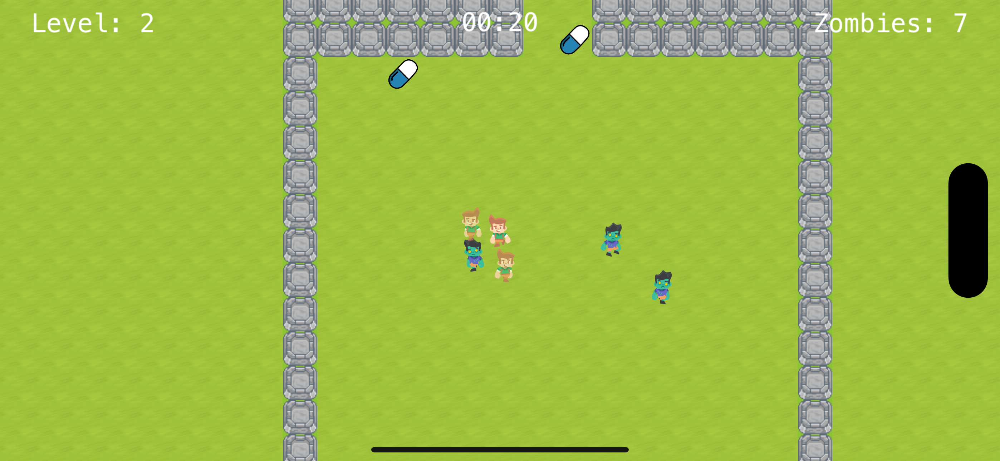
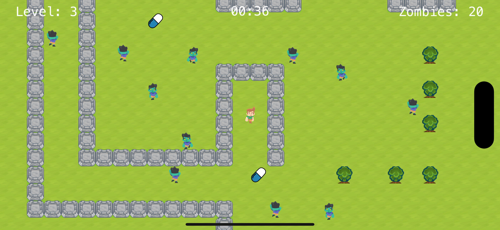

# Zombie Zone

[](https://apps.apple.com/us/app/zombie-zone-clear-zombies/id1531598928)

> **Transform all zombies back into humans in a limited time!**

**Zombie Zone** is a fast-paced, touch-based arcade game for iOS, built with SpriteKit. Play as a hero who must save infected villagers by turning zombies back into humans before time runs out. Use power-ups, avoid obstacles, and challenge yourself across multiple levels. Available in English, Simplified Chinese, and Traditional Chinese.

- **App Store:** [Zombie Zone on the App Store](https://apps.apple.com/us/app/zombie-zone-clear-zombies/id1531598928)

## 📱 Screenshots
<p align="center">
  
  
</p>

---

## 🚀 Features
- Fast-paced, touch-based gameplay
- Multiple handcrafted levels with increasing difficulty
- Animated player and zombie characters
- Power-ups (pills) and obstacles (rocks, walls)
- Heads-up display (HUD) with timer, zombie count, and level info
- Sound effects and background music
- Google Mobile Ads integration (banner and interstitial)
- Multi-language support (English, Simplified Chinese, Traditional Chinese)
- Custom tile and sprite assets

## 🛠 Installation
1. **Clone this repository:**
   ```sh
   git clone https://github.com/banghuazhao/zombie-zone.git
   ```
2. **Install dependencies** (if not already):
   ```sh
   pod install
   ```
3. **Open** `Zombie Zone.xcworkspace` **in Xcode**.
4. **Build and run** on a simulator or device (iOS 11.0+).

## 📦 Dependencies
- [SpriteKit](https://developer.apple.com/spritekit/) (Apple framework)
- [Google-Mobile-Ads-SDK](https://developers.google.com/admob/ios/download)
- [SnapKit](https://github.com/SnapKit/SnapKit) (~> 5.0.0)
- [Then](https://github.com/devxoul/Then)
- [Localize-Swift](https://github.com/malcommac/LocalizationKit) (~> 2.0)

## 🗂 Project Structure
- `Zombie Zone/Controller/` — Main view controller
- `Zombie Zone/Model/` — Game entities: Player, Zombie, FireZombie, Animatable, Types
- `Zombie Zone/Scene/` — GameScene logic and level files (`Level1.sks` ... `Level8.sks`)
- `Zombie Zone/Tile/` — Tile assets and tile set (`MyTileSet.sks`)
- `Zombie Zone/View/` — HUD and UI elements
- `Zombie Zone/Tools/` — Utilities, constants, ad helpers, extensions
- `Zombie Zone/Music/` — Sound effects and background music
- `Zombie Zone/Assets.xcassets/` — App icons and background images
- `Zombie Zone/Config/` — Debug and Release configuration files

## ⚙️ Configuration
AdMob and other configuration values are set in `Config/Debug.xcconfig` and `Config/Release.xcconfig`. Update these files with your own AdMob IDs if needed.

## 🌍 Localization
The game supports English, Simplified Chinese, and Traditional Chinese. Localizable strings are in the `en.lproj`, `zh-Hans.lproj`, and `zh-Hant.lproj` folders.

## 🎨 Assets
- Custom tile maps and sprite atlases for player, zombies, and scenery
- Music and sound effects in `Music/`
- App icons and launch images in `Assets.xcassets/`

## 📲 Download
[](https://apps.apple.com/us/app/zombie-zone-clear-zombies/id1531598928)

## 📄 License
Copyright © 2020-2024 Banghua Zhao. All rights reserved.

---
For questions or contributions, please open an issue or contact the author. 